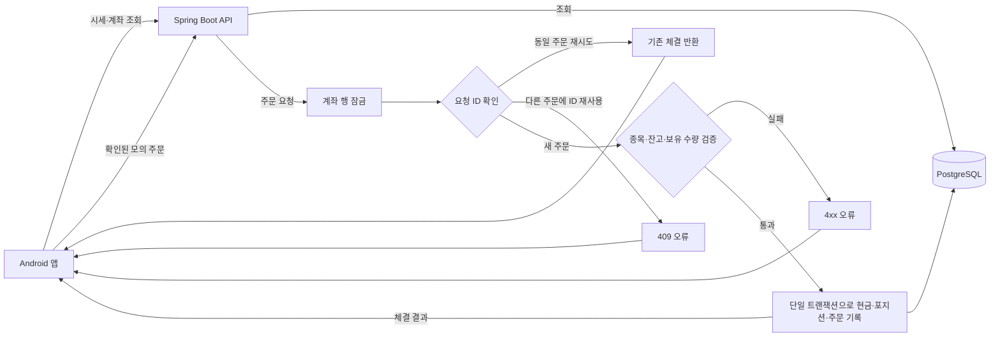

# PaperTrade

Java로 만든 안드로이드 모의 주식 거래 앱입니다. Spring Boot API가 주문과 계좌 상태를 처리하고 PostgreSQL에 저장합니다. 시세와 차트는 모두 예시 데이터이며 실제 증권사, 실시간 시세, 현금 거래와 연결되지 않습니다.

## 화면 미리보기

<table>
  <tr>
    <td></td>
    <td></td>
    <td></td>
    <td></td>
  </tr>
</table>

## 주요 기능

- **시장·관심 종목:** 6개 종목 검색, 관심 종목 저장, 예시 지수와 스파크라인 표시
- **종목 상세:** 예시 시세, 선형·캔들 차트, 기간 선택, 매수·매도 진입
- **모의 주문:** 수량·잔고·보유 수량 검증, 확인 단계, 서버의 즉시 체결 기록
- **포트폴리오·주문 내역:** 가상 현금, 보유 수량, 평균 단가, 평가 손익과 최근 체결 조회
- **연결 끊김 처리:** 마지막 계좌 상태는 읽기 전용으로 보여 주고 새 주문은 차단

## Flowchart



주문 ID는 클라이언트에서 생성합니다. 같은 ID와 내용으로 재시도하면 기존 체결을 반환하고, 같은 ID를 다른 주문에 사용하면 409 오류를 반환합니다. 매수 가능 금액이나 매도 가능 수량이 부족하면 422 오류를 반환합니다.

## 실행 방법

1. Android Studio와 Android SDK Platform 35, Docker Desktop을 설치합니다.
2. 저장소 루트에서 `docker compose up -d`를 실행합니다. PostgreSQL이 준비되면 API가 시작됩니다. 첫 실행에는 Maven 이미지와 의존성 다운로드 시간이 걸릴 수 있습니다.
3. 브라우저에서 [http://localhost:8080/api/stocks](http://localhost:8080/api/stocks)를 열어 API를 확인합니다. 문제가 있으면 `docker compose logs api --tail=80`으로 로그를 확인합니다.
4. 저장소 루트를 Android Studio에서 열고 Gradle 동기화가 끝나면 Android 10(API 29) 이상 에뮬레이터에서 **app**을 실행합니다.

에뮬레이터는 `http://10.0.2.2:8080/api`로 호스트 PC의 API에 접속합니다. 실제 휴대전화에서 실행하려면 `papertradeApiUrl`을 접근 가능한 HTTPS 주소로 바꾸고 서버 인증을 추가해야 합니다. 현재 Docker Compose의 API와 DB 포트는 호스트의 `127.0.0.1`에만 공개됩니다.

Docker 없이 API를 실행하려면 JDK 17, Maven, PostgreSQL 17을 준비하고 DB 연결 정보(`DB_URL`, `DB_USER`, `DB_PASSWORD`)를 설정한 뒤 `mvn -f backend/pom.xml spring-boot:run`을 실행합니다.

## 구성

| 구성 요소 | 역할 |
| --- | --- |
| `app/` | Java 기반 Android UI, 비동기 API 호출, 읽기 전용 캐시 |
| `backend/` | Spring Boot REST API, 거래 검증, JDBC 저장소 |
| `backend/src/main/resources/db/migration/` | Flyway 스키마와 예시 계좌 데이터 |
| `compose.yaml` | API와 PostgreSQL 실행 |

Android Gradle Plugin 8.13.2, Gradle 8.13, Spring Boot 4.1.1, Java 17을 사용합니다. 기본 계좌에는 가상 현금 $24,750과 NVDA 12주, AAPL 8주, MSFT 5주가 들어 있습니다.

### API

| 메서드 | 경로 | 기능 |
| --- | --- | --- |
| GET | `/api/stocks` | 예시 종목과 시세 조회 |
| GET | `/api/account` | 현금, 포지션, 최근 체결 최대 100건 조회 |
| POST | `/api/orders` | 모의 매수·매도 주문 제출 |

주문 요청 예시: `{ "id": "<UUID>", "symbol": "NVDA", "buy": true, "quantity": 2 }`. API의 금액은 달러 실수 대신 **센트 단위 정수**로 주고받습니다.

## 검증

```sh
./gradlew :app:assembleDebug :app:testDebugUnitTest :app:lintDebug
mvn -f backend/pom.xml verify
```

Windows에서는 `gradlew.bat`을 사용합니다. GitHub Actions는 APK 빌드, Android 단위·Robolectric UI 테스트, lint, PostgreSQL 연동 테스트를 실행합니다. APK는 Actions의 `papertrade-build` 아티팩트 또는 `app/build/outputs/apk/debug/app-debug.apk`에서 찾을 수 있습니다. 백엔드 연동 테스트는 예시 계좌를 초기화하므로 개인 데모 데이터가 들어 있는 DB와 분리해서 실행하세요.

## 범위와 한계

이 프로젝트는 단일 계좌를 쓰는 학습용 시연입니다. 사용자 인증, 실시간 시세, 거래소 주문 매칭, 부분 체결은 구현하지 않았습니다. 외부에 공개하려면 HTTPS, 인증·권한 검사, 운영 통제와 원장 설계가 필요합니다.

화면 디자인은 [Webull 거래 플랫폼](https://www.webull.com/trading-platforms)을 참고했으며, Webull 로고·스크린샷·전용 에셋은 사용하지 않았습니다.
